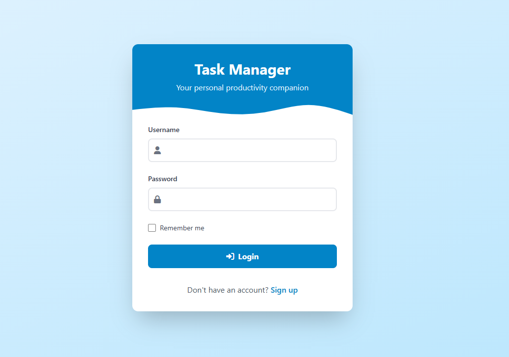
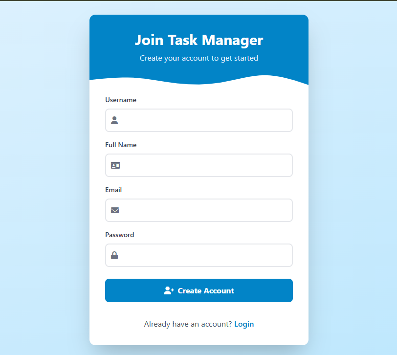
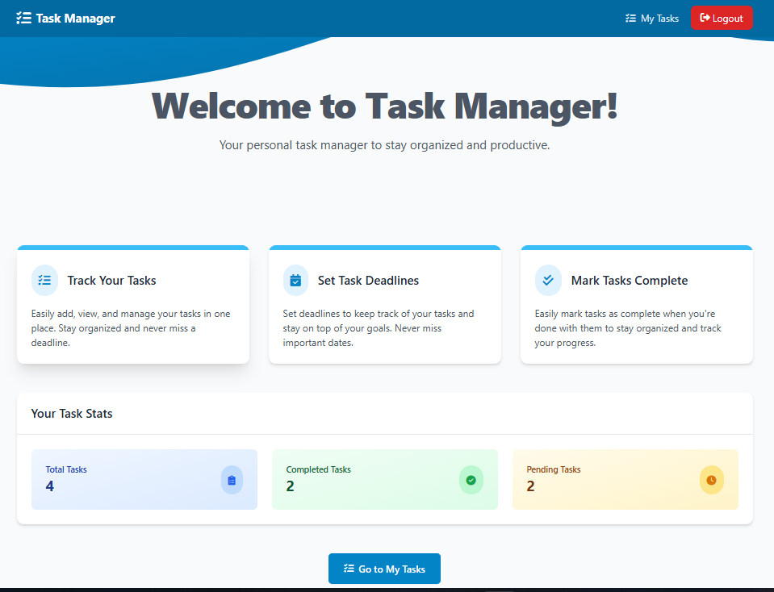
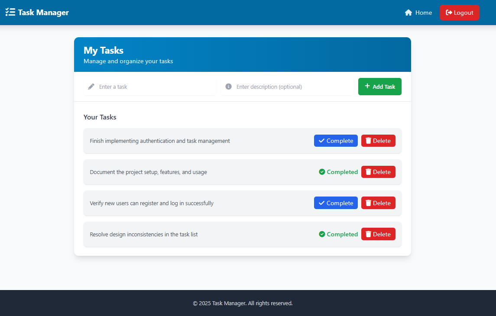

# ✅ Task Manager – Flask + TailwindCSS (GUI Version)

A simple, elegant **Task Manager** built with **Flask** and **TailwindCSS**, allowing users to efficiently **register, log in, and manage their tasks** with a beautiful and responsive UI.

---

## ✨ Features

* 🔐 **User Authentication** (Register & Login with hashed passwords)
* ➕ **Add Tasks** with detailed descriptions
* ✅ **Mark Tasks as Completed** (with real-time updates)
* ❌ **Delete Tasks**
* 👤 **Session-Based User Management**
* 🎨 **Modern UI** styled using **TailwindCSS**
* 💾 **JSON-Based Local Data Storage**

---

## 🚀 Getting Started

### 1. Clone the Repository

```bash
git clone https://github.com/BrahimChatri/flask-task-manager.git
cd flask-task-manager
```

### 2. Install Dependencies

Make sure you have Python installed (3.9+ recommended), then:

```bash
pip install -r requirements.txt
```

### 3. Run the Application

```bash
python app.py
```

Open your browser and visit:
[http://127.0.0.1:5000](http://127.0.0.1:5000)

---

## 📁 Project Structure

```
flask-task-manager/
├── app.py                # Main Flask application
├── .env                  # Environment variables
├── .gitignore
├── LICENSE
├── README.md
├── requirements.txt      # Project dependencies
├── static/               # Tailwind CSS, images
│   ├── home.png
│   ├── login.png
│   ├── register.png
│   └── tasks.png
├── templates/            # HTML templates
│   ├── 404.html
│   ├── home.html
│   ├── index.html
│   ├── login.html
│   ├── profile.html
│   ├── register.html
│   └── tasks.html
└── utils/                # Backend logic
    ├── auth.py           # Authentication logic
    ├── logger.py         # Logger config
    ├── storage.py        # Data handling logic
    ├── views.py          # Main route handlers
    └── __init__.py
```

---

## 🔐 Authentication Overview

* Secure **user registration** with `username`, `name`, `email`, and **hashed password**
* Session-based login/logout system
* Each user sees only **their own tasks**

---

## 🖼️ UI Preview

| Login Page                   | Register Page                      |
| ---------------------------- | ---------------------------------- |
|  |  |

| Home Page                  | Task Dashboard               |
| -------------------------- | ---------------------------- |
|  |  |

---

## 🧰 Tech Stack

* **Flask** (Python-based web framework)
* **TailwindCSS** (modern utility-first CSS framework)
* **HTML / Jinja2 Templates**
* **JSON for Data Storage**
* **Python Logging for Debugging**

---

## 🚧 Planned Improvements

* ⏰ Task Due Dates
* 👤 User Profile Page
* ⚠️ Task Priority Labels
* 📆 Calendar View Integration

---

## 🤝 Contributions

Open to contributions!
Feel free to fork, improve, and submit a pull request.
Let’s build something better together. 🚀

---

## 📄 License

Distributed under the **MIT License** — use it freely.

